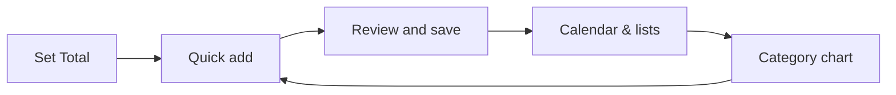

# FlowSpend — simple flow

**Reading this file:** The block below marked `mermaid` is **diagram code**. It draws a picture in **Markdown preview** only. In Cursor / VS Code: **Ctrl+Shift+V** (Mac: **Cmd+Shift+V**) with this file focused, or Command Palette → **Markdown: Open Preview**. In **source view** you only see the raw lines—that is expected.

**What it is:** A calendar-first spending planner in the browser. You add **items** (name, price, category, stage, dates), see them on the **calendar**, and compare **planned spend** to a **Total** you set. Data is saved in **`localStorage`** on your machine.

**The gist (readable anywhere):**

```text
  Set Total  →  Quick add  →  Review and save  →  Calendar & lists  →  Category chart
       ↑___________________________________________________________|
              (you keep adding and reviewing)
```

**The same flow as a diagram** (preview this file to render):



Optional extras (same app): **AI** helps parse what you type (needs local backend if you use it). **Import statement** pulls bank rows into **bought** after you preview.

**Run it:** Open `index.html`, or `npm run dev` and use `http://127.0.0.1:8787/` for the server + AI route.

---

*Deeper diagrams, files, and APIs: [complete technical reference.md](./complete%20technical%20reference.md).*
